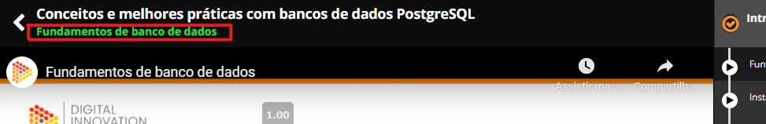

# dio-yt-video
Extensão para o chrome que abre vídeo da aula em outra aba pelo YouTube.

## Como usar 
Com a exensão já instalada, basta dar play na aula e clicar no link verde como mostrado na imagem abaixo

